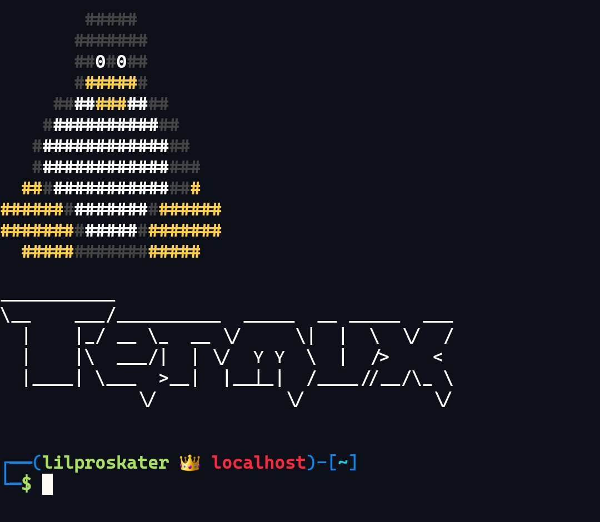

# termux-config


## Installation
1. Install git if you still don't have it and go home :D
   ```
   pkg update
   pkg install git
   cd $HOME
   ```
2. Clone repository
   ```
    git clone https://github.com/lilproskater/termux-config.git
   ```
3. Create ```tp``` (termux path) variable for a while
   ```
   tp=/data/data/com.termux/files
   ```
4. Backup your existing ```bash.bashrc``` and replace original one
   ```
   cp ${tp}/usr/etc/bash.bashrc{,.bak}
   cp ./termux-config/bash.bashrc ${tp}/usr/etc
   ```
5. Copy ```intro``` file to local -> bin and give execute permissions
   ```
   cp ./termux-config/intro ${tp}/usr/local/bin
   chmod +x ${tp}/usr/local/bin/intro
   ```
6. You can optionally customize this ```bash.bashrc``` on your own by modifying aliases, ```PS1``` and etc.
